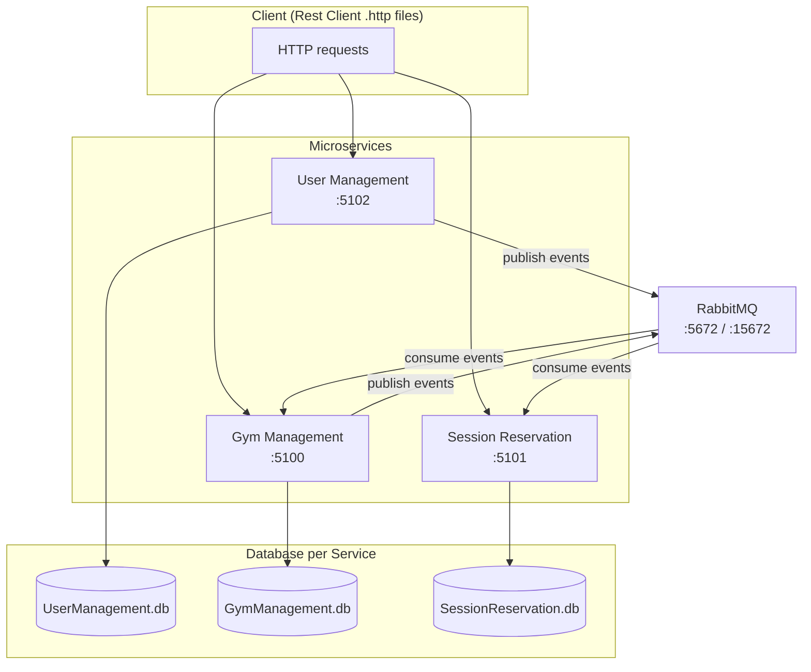
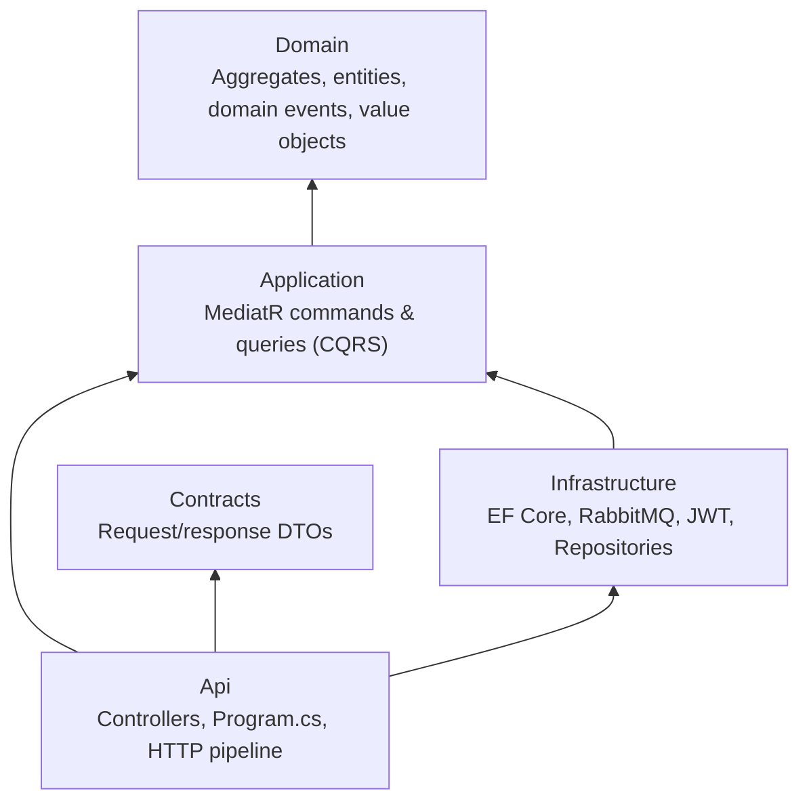
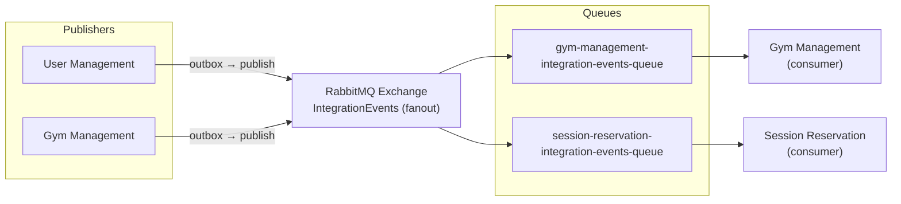
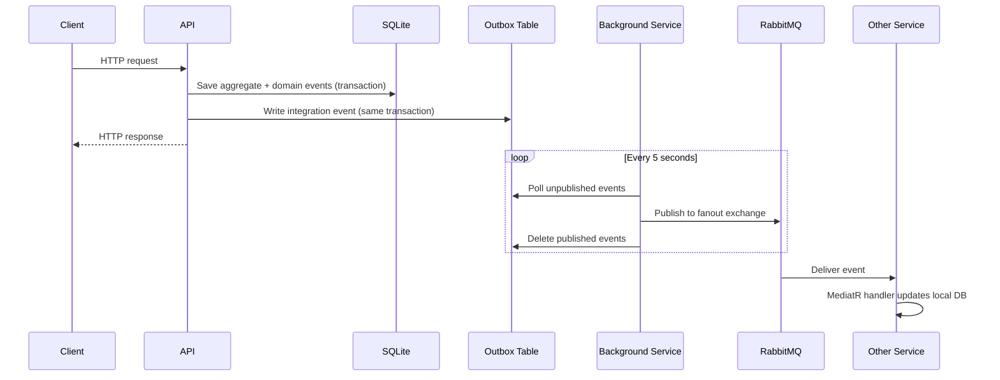
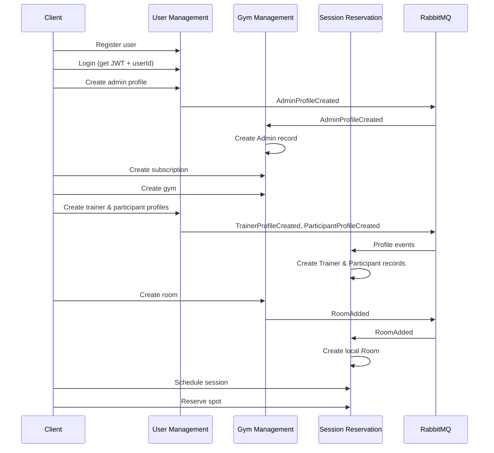

## Overview

**Dome-Gym** is a gym management platform modeled as a **microservices architecture** using **Domain-Driven Design (DDD)**. The system lets gym admins manage subscriptions, gyms, and rooms; trainers schedule and lead sessions; and participants browse and reserve spots in fitness classes.

The platform is split into **three independently deployable .NET 9 services**, each owning its own SQLite database. Services communicate **asynchronously** through **RabbitMQ integration events** using the **transactional outbox pattern** — they never call each other over HTTP.



---

## Bounded Contexts

Each microservice maps to a **bounded context** — a distinct area of the domain with its own model, language, and data store.

| Service | Bounded Context | Responsibility |
|---|---|---|
| **User Management** | Identity & Profiles | User registration, JWT authentication, Admin / Trainer / Participant profile creation |
| **Gym Management** | Gyms & Subscriptions | Subscription plans, gym lifecycle, room management (source of truth for gyms and rooms) |
| **Session Reservation** | Scheduling | Session scheduling, reservations, trainer and participant calendars (core subdomain) |

The ubiquitous language for the domain is documented in [`Assets/UbiquitousLanguageDraft.md`](./Assets/UbiquitousLanguageDraft.md). Planned subdomains are outlined in [`Assets/SubdomainsDraft.md`](./Assets/SubdomainsDraft.md).

---

## Repository Structure

```
Dome-Gym/
├── UserManagement/          # Identity & profiles microservice
│   ├── src/
│   │   ├── UserManagement.Domain/
│   │   ├── UserManagement.Application/
│   │   ├── UserManagement.Infrastructure/
│   │   ├── UserManagement.Api/
│   │   └── UserManagement.Contracts/
│   ├── tests/
│   ├── requests/              # Service-scoped .http files
│   ├── Dockerfile
│   └── UserManagement.sln
│
├── GymManagement/             # Subscriptions, gyms & rooms microservice
│   ├── src/                   # Same layered structure
│   ├── tests/
│   ├── requests/
│   ├── Dockerfile
│   └── GymManagement.sln
│
├── SessionReservation/        # Sessions & reservations microservice
│   ├── src/                   # Same layered structure
│   ├── tests/
│   ├── requests/
│   ├── Dockerfile
│   └── SessionReservation.sln
│
├── SharedKernel/              # Cross-service integration event contracts only
├── requests/                  # Root-level .http files for end-to-end flows
├── Assets/                    # DDD design drafts (language, subdomains, invariants)
├── scripts/                   # wait-for-it.sh (RabbitMQ readiness check)
├── docker-compose.yml         # Orchestrates all services + RabbitMQ
└── .vscode/                   # Rest Client environment variables, launch/tasks
```

Each microservice is a **self-contained solution** with its own solution file, Dockerfile, database, and request collection. The monorepo layout keeps all services together for the course while preserving independent deployability.

---

## Layered Architecture (per service)

Every microservice follows the same **Clean Architecture / DDD layering**:



| Layer | Responsibility |
|---|---|
| **Domain** | Business rules, aggregates, domain events, value objects. No infrastructure dependencies. |
| **Application** | Use cases orchestrated via MediatR (`IRequest` / `IRequestHandler`). CQRS-style commands and queries. |
| **Infrastructure** | EF Core persistence (SQLite), RabbitMQ messaging, JWT auth, repository implementations, background services. |
| **Api** | ASP.NET Core controllers, middleware, dependency injection wiring. |
| **Contracts** | Public API DTOs shared between the Api layer and external consumers. |

---

## Microservice Details

### User Management (`:5102`)

**Source of truth** for users and profile identities.

**Key aggregate:** `User` — holds credentials and optional profile IDs (`AdminId`, `TrainerId`, `ParticipantId`).

| Endpoint | Method | Description |
|---|---|---|
| `/authentication/register` | POST | Register a new user |
| `/authentication/login` | POST | Login and receive a JWT |
| `/users/{userId}/profiles/admin` | POST | Create an admin profile (JWT required, must match `userId`) |
| `/users/{userId}/profiles/trainer` | POST | Create a trainer profile |
| `/users/{userId}/profiles/participant` | POST | Create a participant profile |
| `/users/{userId}/profiles` | GET | List all profiles for a user |

**Database tables:** `Users`, `OutboxIntegrationEvents`

**Publishes integration events:** `AdminProfileCreated`, `TrainerProfileCreated`, `ParticipantProfileCreated`

---

### Gym Management (`:5100`)

**Source of truth** for subscriptions, gyms, and rooms.

**Key aggregates:**

| Aggregate | Role |
|---|---|
| `Admin` | Mirrors admin profiles from User Management; linked to a subscription |
| `Subscription` | Plan tier (Free / Starter / Pro) with capacity limits |
| `Gym` | A facility within a subscription; manages rooms and trainers |
| `Room` | A space within a gym for conducting sessions |

**Subscription tiers:**

| Tier | Max Gyms | Max Rooms per Gym | Max Sessions per Room / Day |
|---|---|---|---|
| Free | 1 | 1 | 4 |
| Starter | 1 | 3 | Unlimited |
| Pro | 3 | Unlimited | Unlimited |

| Endpoint | Method | Description |
|---|---|---|
| `/subscriptions` | POST, GET | Create or list subscriptions |
| `/subscriptions/{subscriptionId}/gyms` | POST, GET | Create or list gyms |
| `/subscriptions/{subscriptionId}/gyms/{gymId}` | GET | Get a gym |
| `/subscriptions/{subscriptionId}/gyms/{gymId}/trainers` | POST | Add a trainer to a gym |
| `/gyms/{gymId}/rooms` | POST | Create a room |
| `/gyms/{gymId}/rooms/{roomId}` | DELETE | Delete a room |

**Database tables:** `Admins`, `Subscriptions`, `Gyms`, `OutboxIntegrationEvents`

**Publishes integration events:** `RoomAdded`, `RoomRemoved`
**Consumes integration events:** `AdminProfileCreated`, `SessionScheduled`

---

### Session Reservation (`:5101`)

**Source of truth** for sessions, reservations, and schedules. Maintains a **local read model** of rooms synced from Gym Management via integration events.

**Key aggregates:**

| Aggregate | Role |
|---|---|
| `Room` | Local copy of a gym room; used to schedule sessions |
| `Session` | A fitness class with capacity, trainer, and reservations |
| `Trainer` | Trainer schedule and assigned sessions |
| `Participant` | Participant schedule and reserved sessions |
| `Reservation` | A participant's spot in a session |

| Endpoint | Method | Description |
|---|---|---|
| `/gyms/{gymId}/sessions` | GET | List sessions (filterable by date/category) |
| `/gyms/{gymId}/rooms` | GET | List rooms |
| `/gyms/{gymId}/rooms/{roomId}` | GET | Get a room |
| `/rooms/{roomId}/sessions` | POST | Schedule a session |
| `/rooms/{roomId}/sessions/{sessionId}` | GET | Get a session |
| `/sessions/{sessionId}/reservations` | POST | Reserve a spot |
| `/participants/{participantId}/sessions` | GET | List participant's sessions |
| `/participants/{participantId}/sessions/{sessionId}/reservation` | POST, DELETE | Reserve or cancel a spot |

**Database tables:** `Rooms`, `Sessions`, `Trainers`, `Participants`

**Consumes integration events:** `TrainerProfileCreated`, `ParticipantProfileCreated`, `RoomAdded`, `RoomRemoved`

---

## SharedKernel

[`SharedKernel/`](./SharedKernel/) contains **integration event contracts only** — no shared business logic or database access. Each service references this project to serialize and deserialize events over RabbitMQ without coupling domain models.

```
SharedKernel/IntegrationEvents/
├── IIntegrationEvent.cs
├── SessionScheduledIntegrationEvent.cs
├── UserManagement/
│   ├── AdminProfileCreatedIntegrationEvent.cs
│   ├── TrainerProfileCreatedIntegrationEvent.cs
│   └── ParticipantProfileCreatedIntegrationEvent.cs
└── GymManagement/
    ├── RoomAddedIntegrationEvent.cs
    └── RoomDeletedIntegrationEvent.cs
```

---

## Event-Driven Integration

Services stay decoupled through **async messaging**. There are no HTTP calls between microservices — the client orchestrates cross-service workflows by calling each API directly.

### Messaging topology



### Integration events

| Event | Publisher | Consumers | Effect |
|---|---|---|---|
| `AdminProfileCreated` | User Management | Gym Management | Creates an `Admin` record |
| `TrainerProfileCreated` | User Management | Session Reservation | Creates a `Trainer` record |
| `ParticipantProfileCreated` | User Management | Session Reservation | Creates a `Participant` record |
| `RoomAdded` | Gym Management | Session Reservation | Creates a local `Room` read model |
| `RoomRemoved` | Gym Management | Session Reservation | Deletes room and cancels its sessions |
| `SessionScheduled` | — | Gym Management | Adds trainer to gym *(consumer exists; publisher not yet wired)* |

### Outbox pattern

User Management and Gym Management use the **transactional outbox pattern** to guarantee reliable event delivery:



1. An HTTP request triggers a domain change inside a database transaction.
2. `EventualConsistencyMiddleware` defers domain event dispatch until after the response.
3. `OutboxWriterEventHandler` writes integration events to the `OutboxIntegrationEvents` table.
4. `PublishIntegrationEventsBackgroundService` polls the outbox every 5 seconds and publishes to RabbitMQ.
5. Consumer services receive events via dedicated queues and dispatch them to MediatR handlers.

---

## End-to-End Flow

The recommended order for exercising the full system:



| Step | Request file | Update in settings |
|---|---|---|
| 1. Register | `requests/Authentication/Register.http` | `userId`, `token` |
| 2. Login | `requests/Authentication/Login.http` | `userId`, `token` |
| 3. Create admin | `requests/Profiles/CreateProfile.http` | `adminId` |
| 4. Create subscription | `requests/Subscriptions/CreateSubscription.http` | `subscriptionId` |
| 5. Create gym | `requests/Gyms/CreateGym.http` | `gymId` |
| 6. Create trainer/participant | `requests/Profiles/CreateProfile.http` | `trainerId`, `participantId` |
| 7. Create room | `requests/Rooms/CreateRoom.http` | `roomId` |
| 8. Schedule session | `requests/Sessions/CreateSession.http` | `sessionId` |
| 9. Reserve spot | `requests/Reservations/CreateReservation.http` | — |

---

## DDD Patterns

| Pattern | Where |
|---|---|
| **Bounded contexts** | Three microservices with separate databases and ubiquitous language |
| **Aggregates** | `User`, `Admin`, `Subscription`, `Gym`, `Session`, `Trainer`, `Participant` |
| **Domain events** | `AdminProfileCreatedEvent`, `RoomAddedEvent`, `SessionScheduledEvent`, etc. |
| **Integration events** | SharedKernel contracts delivered via outbox + RabbitMQ |
| **Eventual consistency** | `EventualConsistencyMiddleware` — transactional writes with deferred event dispatch |
| **CQRS** | MediatR commands and queries in the Application layer |
| **Repository pattern** | `IUsersRepository`, `IGymsRepository`, `ISessionsRepository`, etc. |
| **Value objects** | `TimeRange`, `Schedule`, `SessionCategory`; smart enum `SubscriptionType` |
| **Anti-corruption layer** | Session Reservation maintains its own `Room` read model from integration events |
| **Outbox pattern** | Transactional outbox before RabbitMQ publish (User Management, Gym Management) |
| **Error handling** | `ErrorOr` library; controllers map errors to HTTP status codes |

---

## Tech Stack

| Component | Technology |
|---|---|
| Runtime | .NET 9 |
| Web framework | ASP.NET Core |
| ORM | Entity Framework Core (SQLite) |
| Messaging | RabbitMQ (fanout exchange) |
| Mediator | MediatR |
| Auth | JWT (User Management) |
| Error handling | ErrorOr |
| Containerization | Docker / Docker Compose |
| API testing | VS Code Rest Client (`.http` files) |

---

## Running Locally

### Prerequisites

- [Docker Desktop](https://www.docker.com/products/docker-desktop/)
- [Rest Client](https://marketplace.visualstudio.com/items?itemName=humao.rest-client) VS Code extension

### Start all services

Run from the repository root:

```shell
docker compose up --build
```

This starts all three APIs and RabbitMQ:

| Service | URL | Purpose |
|---|---|---|
| Gym Management API | http://localhost:5100 | Subscriptions, gyms, rooms |
| Session Reservation API | http://localhost:5101 | Sessions, reservations |
| User Management API | http://localhost:5102 | Auth, profiles |
| RabbitMQ Management UI | http://localhost:15672 | Message broker dashboard (guest/guest) |

> **Tip:** On a cold start, the API containers may time out waiting for RabbitMQ (~30s). If they exit, restart them with `docker compose up -d` once RabbitMQ is healthy.

### Make requests using `.http` files

Each microservice has a `requests/` folder with HTTP request definitions. A root-level [`requests/`](./requests/) folder provides end-to-end flows across all services.

Example — create a gym:

```http
POST {{gym-host}}/subscriptions/{{subscriptionId}}/gyms
Content-Type: application/json

{
    "Name": "Amiko's gym"
}
```

#### Environment variables

Rest Client variables are defined in [`.vscode/settings.json`](./.vscode/settings.json):

```json
{
    "rest-client.environmentVariables": {
        "$shared": {
            "userId": "...",
            "adminId": "...",
            "trainerId": "...",
            "participantId": "...",
            "subscriptionId": "...",
            "gymId": "...",
            "roomId": "...",
            "sessionId": "...",
            "token": "..."
        },
        "docker": {
            "gym-host": "http://localhost:5100",
            "session-host": "http://localhost:5101",
            "user-host": "http://localhost:5102"
        }
    }
}
```

#### Steps

1. Set the **Rest Client Environment** to `docker`
   - Command palette (`Ctrl+Shift+P`) → **Rest Client: Switch Environment** → `docker`
2. Run `Register.http` or `Login.http` to get a fresh `token` and `userId`
3. Update the corresponding variables in `.vscode/settings.json` after each resource creation
4. Execute the remaining `.http` files in the recommended order above

#### Authentication

Profile endpoints require a JWT bearer token. The `userId` in the URL **must match** the `id` claim in the token — you can only create profiles for yourself. After login/register, update both `token` and `userId` in settings from the same response.

---

## Useful Commands

```shell
# Start all services (detached)
docker compose up -d

# View logs
docker compose logs -f

# Stop all services
docker compose down

# Rebuild after code changes
docker compose up --build
```
